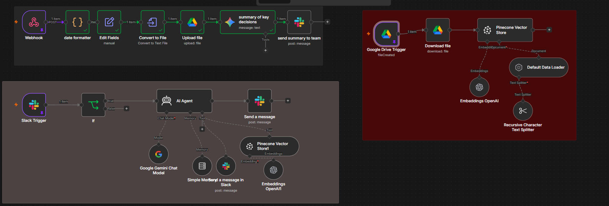

# Searchable Meeting Memory System with n8n, Pinecone, and Slack

A meeting summary is useful for one day. A searchable meeting memory is useful for months.

This project turns meeting transcripts into a searchable team knowledge base. It stores each transcript, creates a short summary, indexes the transcript in Pinecone, and lets a team ask questions about past meetings from Slack.

The public workflow is a sanitized, reproducible version of the demonstrated system. It does not contain private credential bindings, Google Drive folder IDs, Slack channel IDs, or n8n instance metadata.

## What the system does

1. A meeting capture client sends a transcript to an n8n webhook.
2. n8n stores the transcript as a text file in Google Drive.
3. Gemini creates a three-bullet decision summary.
4. n8n posts the summary to Slack.
5. A Google Drive trigger detects the new transcript.
6. n8n splits and embeds the transcript.
7. Pinecone stores the transcript as searchable vectors.
8. A Slack-triggered AI agent retrieves relevant meeting context from Pinecone.
9. The agent answers the team in the same Slack channel.



*Figure 1. The executed n8n workflow contains the intake, summarization, indexing, and Slack retrieval paths.*

## Architecture

```text
Meeting capture client
        |
        v
    n8n Webhook
        |
        +--> Normalize transcript --> Text file --> Google Drive
        |                                      |
        |                                      +--> Gemini summary --> Slack
        |
        v
Google Drive Trigger
        |
        v
Download transcript --> Split text --> OpenAI embeddings --> Pinecone
                                                        |
                                                        v
Slack message --> Bot-loop filter --> AI Agent --> Pinecone retrieval
                                      |
                                      v
                                Slack response
```

## Technology

- n8n
- Google Drive
- Slack
- Pinecone
- OpenAI embeddings
- Google Gemini
- Retrieval-augmented generation (RAG)
- Browser-based meeting capture prototype

## Repository contents

- [`workflows/searchable-meeting-memory-system.json`](workflows/searchable-meeting-memory-system.json) — sanitized n8n workflow.
- [`SETUP.md`](SETUP.md) — full setup and test guide.
- [`evidence/EVIDENCE-MAP.md`](evidence/EVIDENCE-MAP.md) — what each screenshot proves and does not prove.
- [`SECURITY.md`](SECURITY.md) — security and privacy rules for deployment.

## Evidence

The archive contains screenshots of:

- the complete n8n workflow;
- a custom browser capture interface;
- the capture interface running beside a Google Meet call;
- a successful “Transcript sent to n8n” state; and
- an executed n8n workflow with the meeting-memory paths visible.

The screenshots support the architecture and capture flow. They do not prove production-scale reliability, transcription accuracy, or long-term retrieval quality.

## Project status

**Status: working prototype / portfolio implementation.**

The n8n workflow and capture flow were demonstrated. The public repository does not include the source code for the original browser capture client because that source was not present in the project archive. You can reproduce the backend with any approved transcription client that sends the required transcript payload.

## Public-repo safety

Do not commit API keys, OAuth tokens, workspace IDs, private meeting transcripts, participant information, or live webhook secrets. The workflow file in this repository has been sanitized before publication.

## Setup

Follow [`SETUP.md`](SETUP.md) to configure the workflow from a clean n8n instance.
